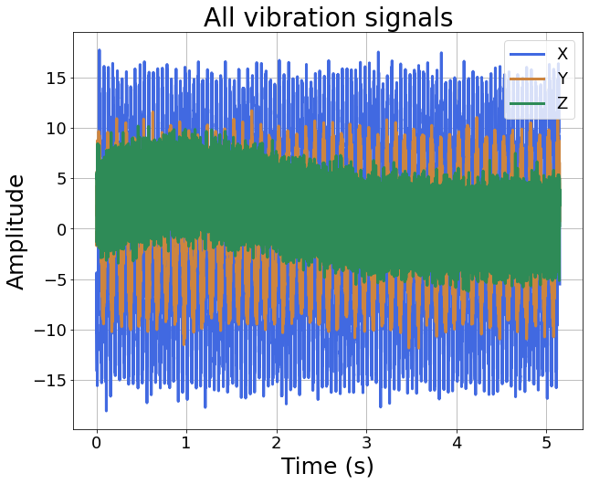

<br />
<div align="center">
  <h1 align="center">Data mining with time series</h1>
  <h2 align="center">The current repository is still in progress and the contents may change!</h2>
  <h3 align="center">
    A combination of signal analysis and machine-learning algorithms.
    <br />
  </p>
</div>
(English is not my first language, so it may be hard to read this page. Sorry (/ _ \).)

I originally made this repo. to deal with a cooperative education program I participated in during my study. This Python library contains .py files to perform **signal processing**, **constructing machine learning algorithms**, and **plotting signal spectra**. These files helped me a lot, and hopefully, they may be found useful in your projects as well.

In this repo., one data and a folder are examples of how to use the .py files contained. For a better understanding, I am gonna make an imaginary scenario in which these example files originate.

<h2 align="center">Imaging a machining process that can be monitored by working conditions such as vibrations, temperature, or any other signals. The goal is to predict the resultant surface quality of the process with the captured signals.</h2>

First, the **empirical data** (I made it up) are created, which are **'demo_y.csv'** and **folder 'demonstration_signal_dataset'**. The former is the **recorded quality values of several machining processes**, and the latter contains their corresponding **signals (.csv) captured during processes**.

### **'waveMaker.py'** describes the details of determining created signals and quality values. Please execute it first before moving on to other .py files.
<h1 align="center">
waveMaker.py
</h1>
The created data have multiple attribute to be manipulated. Starting with sampling rate, recording duration, and the total amount of machining process conducted. The number can be changed at will.


```
sr = int(20000/10) # the sampling rate
time_total = 5 # the recording duration
num_run = 50 # the total amount of machining process conducted.
```

After that, the empirical data (containing **sigals & quality values**) is created in a loop.

In the loop, I use ***'random_seed'*** variable to create **numerical fluctuations** on signals' attributes (such as frequency, time, amplitude, etc.) and the 'y' values, which **resembles a noised recordings in real applicaitons**. 

*In my experience, the real-world datasets from manufacturers tends to be MESSY and DIRTY AS HECK, so such a processing is necessary to simulate the real situation.*

### Any variable named after ***'amplidtude'*** control the **amplitudes of signals**.

### Any variable named after ***'sig'*** are **signals recorded** during the machining process (in this imaginary scenario).

The recorded signals are composed of serveral signal components. The signal components can be defined by the function ***sinMaker*** and ***expMaker***, and variable ***noise***
```
def sinMaker(A, W, THETA):
    # A: amplitude; W: Hz; THETA: phase angle
    return A * np.sin((W * 2*np.pi) * t + THETA)

def expMaker(A, G, Tau, isGaussian=True):
    # A: amplitude of exp()
    # G: growing value
    # Tau: time shift (>0: lag, <0: ahead)
    newTimeVector = G * (t - Tau)
    if isGaussian:
        newTimeVector = newTimeVector - 0.5 * (t + -1 * Tau) ** 2
    return A * np.exp(newTimeVector)

noise = np.random.normal(0,1,t.shape[0])
```

### Any variable named after ***'y'*** are **resultant quality** of the current machining process (in this imaginary scenario). 

In the code below, it can be seen that I respectively define **3** different **signals** and **y value** for each run in the loop.

**Signals of processing runs** consists a distinct sets of components with ***fluctuated amplitude*** and ***fixed frequency***. And they are assigned to variable ***dataset_sig***

**y values**, aka **surface qualities**, are defined by the ***amplitudes of signals*** and ***random_seed***. And they are assigned to variable ***dataset_y***
```
dataset_sig = []
dataset_y = []
for run_idx in range(num_run):
    random_seed = np.random.uniform(0.1, 0.3)
    t = np.arange(0, time_total*(1+np.random.uniform(0,0.1)), 1/sr)
    print(f'final time = {t[-1]:.2f} | time length = {t.shape[0]:.2f}')
    noise = np.random.normal(0,1,t.shape[0])
    amplitude_1 = np.array([10, 2, 1]) * (1 + random_seed)
    amplitude_2 = np.array([6, 1, 0.5]) * (1 + random_seed)
    amplitude_3 = np.array([3, 2, 1]) * (1 + random_seed)
    sig1 = sinMaker(A = amplitude_1[0], W = 20, THETA = 10) + sinMaker(A = amplitude_1[1], W = 230, THETA = 5) + sinMaker(A = amplitude_1[2], W = 500, THETA = 90) + noise
    sig2 = sinMaker(A = amplitude_2[0], W = 10, THETA = 0) + sinMaker(A = amplitude_2[1], W = 100, THETA = 30) + sinMaker(A = amplitude_2[2], W = 900, THETA = 90) + noise
    sig3 = sinMaker(A = amplitude_3[0], W = 120, THETA = 30) + expMaker(amplitude_3[1], 1, 0) + expMaker(amplitude_3[2], 2, 6) + expMaker(amplitude_3[2], 1.5, 15) + noise
    run_content = np.concatenate((t.reshape(-1, 1), sig1.reshape(-1, 1), sig2.reshape(-1, 1), sig3.reshape(-1, 1)), axis=1)
    dataset_sig.append(run_content.T)
    
    y1 = (amplitude_1[0] + amplitude_2[1]) * (1+amplitude_3[2]) * (1 + random_seed)
    y2 = ((amplitude_1[0] * amplitude_3[1] + amplitude_1[2]) - amplitude_2[0] * amplitude_2[2]) * (1 + random_seed)
    y3 = amplitude_1[0] * (1+amplitude_3[0]) * (1+amplitude_3[2]) * amplitude_3[1] * (1 + random_seed)
    dataset_y.append(np.array([y1, y2, y3]))
dataset_y = np.array(dataset_y)
```
***dataset_sig*** should be the list containing ***num_run*** numpy arrays, and each array have **4 rows** **(time, sig1, sig2, sig3)** and columns with inconsistent amounts, as the **signal lengths are different**.

BTW, when each run's data is created, it prints the recorded length of that run: 
```
final time = 5.21 | time length = 10411.00
final time = 5.30 | time length = 10600.00
final time = 5.45 | time length = 10900.00
final time = 5.06 | time length = 10121.00
...
...
...
```

Now that we have the whole datasets, which are dataset_sig and dataset_y, we can save them as .csv.
```
def save_files(folder, data_sig, data_y):
    for run_idx, run in enumerate(data_sig):
        if run_idx < 10:
            np.savetxt(f'.\\{folder}\\demo_signals_0{run_idx}.csv', run.T, delimiter=',')
        else:
            np.savetxt(f'.\\{folder}\\demo_signals_{run_idx}.csv', run.T, delimiter=',')
    np.savetxt(f'.\\demo_y.csv', data_y, delimiter=',')

save_files('demonstration_signal_dataset', dataset_sig, dataset_y)
```

The csv files should be located like this:
```
${Data-Mining-w-Time-Series-For_demonstration}
├── demo_y.csv
├── demonstration_signal_dataset
    ├── demo_signals_00.csv
    ├── demo_signals_01.csv
    ├── demo_signals_02.csv
    ...
    ...
```

Okay, so that is the end of the construction of the imaginary datasets. In **real situations**, you obtain the datasets **WITHOUT knowing how they are constructed**.

<h2 align="center">
So let's just forget how we build our datasets, and assuming we gathered those thing from machining processes (such as milling) in real world.
</h2>

**Signals** can be assumed as ***vibration in 3 axes*** (X, Y, Z), and we can see **y values** as ***surface roughness***, ***width of milled grooves***, or any other thing you come out with. It's time for your imagination.

Now, with signals and quality records gathered from machining processes, we want to **examine their relations**, as it is helpful for us to **understand the mechanisms underlying the machining process**. The major functionalities of the repo. can be divided into three topics, which are related to different .py files below:

<h1 align="center">
signal_processing.py
</h1>
<h2 align="center">
Processing the captured signals using time-domain, frequency-domain, or time-frequency-domain analyses.
</h2>
<h3 align="center">
I am gonna demonstrate how signal processing can be done with this file.
</h3>

First, we have to load our signal datasets & quality datasets. 

After that, let's look at signals in one arbitrary run.

```
signals_runs = sigpro.get_signals('.\\demonstration_signal_dataset', first_signal_minus=False)
sample_rate = int(20000/10) # you have to know your signal sampling rate before analyzing signals.
time_runs = sigpro.pick_one_signal(signals_runs, signal_idx=0)
run_idx_demo = 10 # the designate index of process run, this number can be changed at will.
run_signals = signals_runs[run_idx_demo] # run_signals.shape = (4, 10296)
```

Importing signal_processing.py and see what signals does the run have.
```
import signal_processing as sigpro
sigplot.draw_signals(run_signals[1:], run_signals[0], legend_lst=['X', 'Y', 'Z'], color_lst=['royalblue', 'peru', 'seagreen'], title='All vibration signals')
# run_signals[0] are time stamps, while run_signals[1:] are all 3 signals of the run
```
 

As you can see, all 3 signals are plotted. 

***sigplot.draw_signals()*** doesn't care how many signals are in the run_signals. As long as **first row** stands for **time** and **the rest rows** are **signals**, every signal can be shown with this function.

You can designate the **names of signals** and the **presented color of signals** in form of **list**.

Then use those list as **arguments** for ***legend_lst*** and ***color_lst*** respectively.

<h1 align="center">
featureExtraction.py & autoencoder.py
</h1>
<h2 align="center">
Extracting features from the signals.
</h2>

<h1 align="center">
cross-validation.py, correlation_analysis.py, and any .py with 'classPSO' as prefix
</h1>
<h2 align="center">
Analyzing the relations between extracted features and qualities, or constructing machine-learning models to predict the qualities based on input signals.
</h2>
