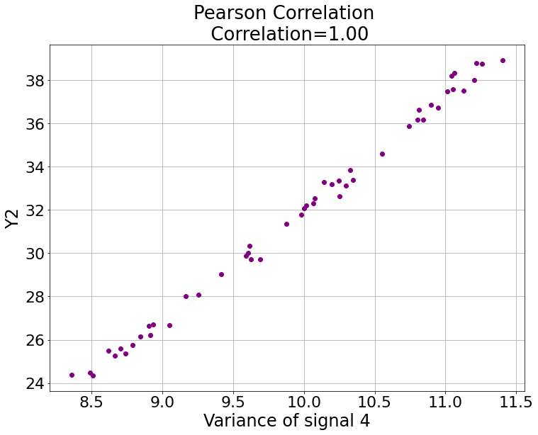
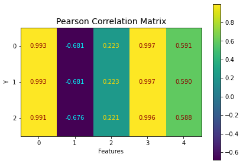

<h1 align="center">
featureExtraction.py
</h1>
<h2 align="center">
Extracting features from the signals.
</h2>

### To dissect captured signals, it's beneficial to get signals' characteristics with statistical method.

Before we go further, let's load our datasets made by [waveMaker.py](waveMaker.md "link" ).

To focus on the topic, we only deal with the **3rd signals** recorded from all process runs.

If you want to see what this signal looks like, go check [detail of signal_processing.py](signal_processing.md "link" )

```
signals_runs = sigpro.get_signals('.\\demonstration_signal_dataset', first_signal_minus=False)
sample_rate = int(20000/10)
y = np.genfromtxt('demo_y.csv', delimiter=',')
siganl_idx_demo = 3
signal_runs = sigpro.pick_one_signal(signals_runs, signal_idx=siganl_idx_demo)
```

After obtaining the signal, we can extract it's **statistical characteristic** using ***featureExtraction.py***.

Go check ***featureExtraction.TimeFeatures.getTimeFeatures()*** to see what kind of statistical feature can we get with the argument ***target_lst*** of ***featureExtraction.TimeFeatures()***.

I am gonna focus on the 5 features I use the most, which are ***Root Mean Square**, **Kurtosis**, **Skewness**, **Variance**, and **Maximum Peak-To-Peak value**. ([Reference of Kurtosis and Skewness](https://docs.scipy.org/doc/scipy/reference/stats.html "link" ))

```
import featureExtraction as feaext
features_time = feaext.TimeFeatures(signal_runs, target_lst=['rms', 'kurtosis',  'skewness', 'variance', 'p2p'])
features = features_time.features_all_signals
features_name = features_time.feature_names
print(features.shape) # (50, 5), signals from 50 runs, and each one of them yields 5 features
print(features_name) # (50, 5)
```

**Statistical features**, which are directly extract from signals in the ***time domain**, are helpful.

But we can get more information from signals in the **frequency domain** using *FFT*.

Let's extract features of the **3 most prominent frequencies** contributing to the signals. The features are the **energy values in the spectrum** and the **frequency numbers**.

```
features_freq = feaext.FreqFeatures(signal_runs, sample_rate, num_wanted_freq=3) # num_wanted_freq is the number of prominent frequencies we wanna find.
domain_fre = features_freq.domain_frequency
domain_energy = features_freq.domain_energy
domain_fre_name = features_freq.feature_name_freq
domain_energy_name = features_freq.feature_name_energy

print(domain_fre.shape) # (50, 3), signals from 50 runs, and each one of them give 3 features.
print(domain_fre_name.shape) # (50, 1), each signal from 50 runs give the feature called 'Top 3 Frequencies of Signal'.

print(domain_energy.shape) # (50, 3), signals from 50 runs, and each one of them give 3 features.
print(domain_energy_name.shape) # (50, 1), each signal from 50 runs give the feature called 'Top 3 Energies of Signal'.
```

We can now do whatever we want to analyze signals base on their features. So let's start doing something.

The purpose of feature extraction is to **find features highly related to the result of the machining process**. 

In this imaginary scenario, we wanna find the signal feature related to the surface quality of the machined workpiece.

With those prominent features, we can **predict the machining results**, and this prediction is very beneficial to **monitoring the machining process**, as we don't need to waste time on measruing the surface quality of machined workpiece.

One way to check the **relevances between signal features and the resultant quality of process** is ***Pearson Correlation Coefficient*** *(PCC)*. ([Reference](https://numpy.org/doc/stable/reference/generated/numpy.corrcoef.html "link" ))

First, we find the *PCC* between **the Variance of signal** and **the 2nd quality value**.

Then, we see the PCC between **all signal features** and **all quality value**.

```
import correlation_analysis as corr
y_idx_demo = 1
if plot_corr:
    feature_idx = 3
    corr.get_corr_value_2variables(features[:, feature_idx], y[:, y_idx_demo], title_='Pearson Correlation', content_=[f'{features_name[0, feature_idx]} of signal {siganl_idx_demo+1}', f'Y{y_idx_demo+1}'])
    
if plot_matrix:
    features_time_y_corr = corr.features_vs_quality(features, y)
    corr.plot_correlation_matrix(features_time_y_corr)
```



 
