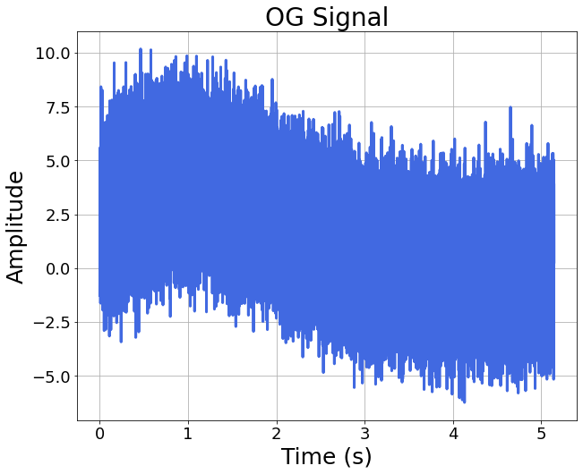
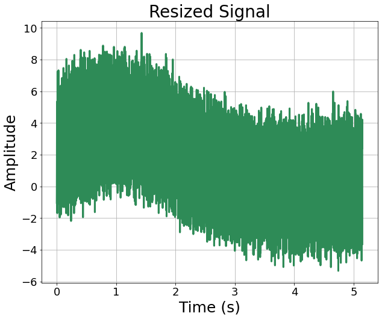
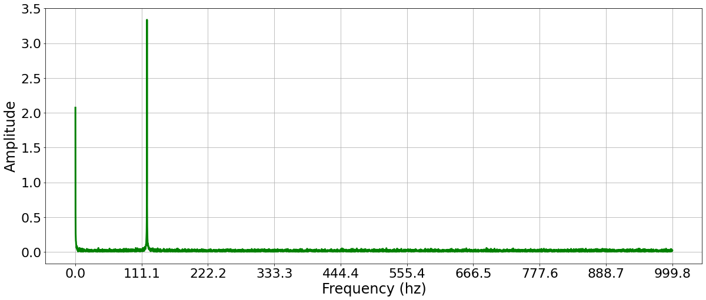
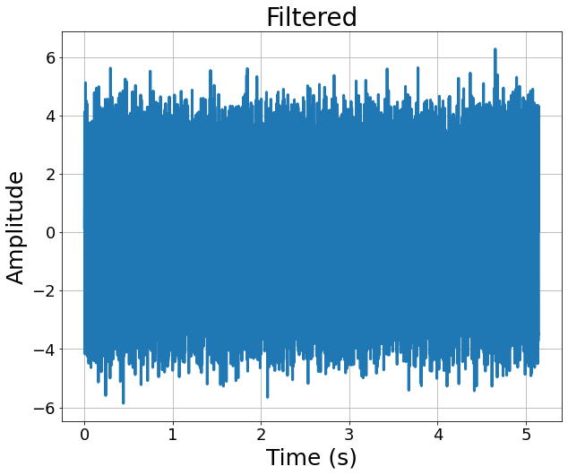
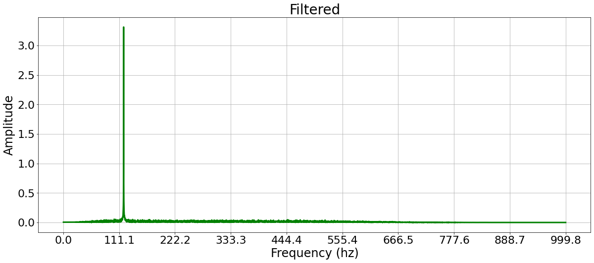
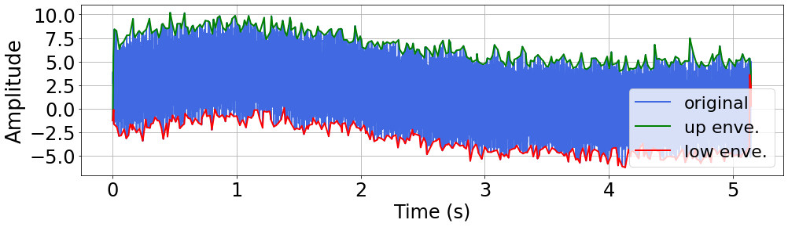
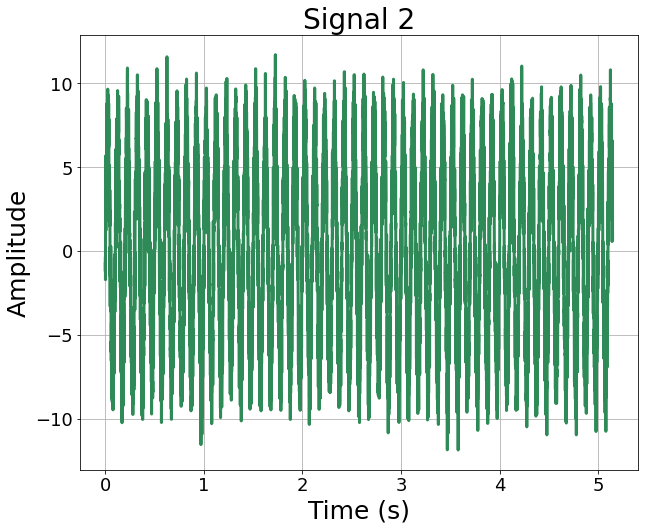
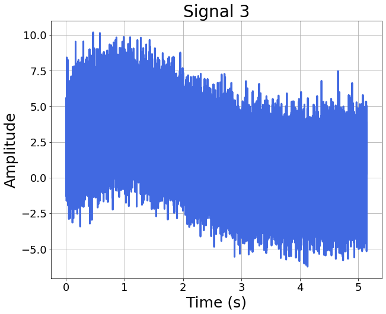
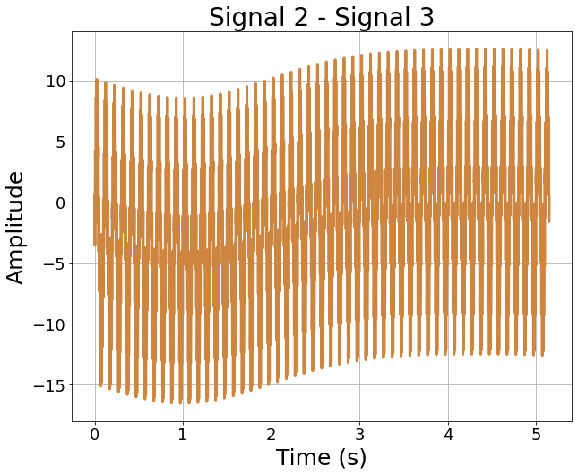

<h1 align="center">
signal_processing.py
</h1>
<h2 align="center">
Processing the captured signals using time-domain, frequency-domain, or time-frequency-domain analyses.
</h2>
<h3 align="center">
I am gonna demonstrate how signal processing can be done with this file.
</h3>

First, we have to load our signal datasets & quality datasets. 

After that, **let's look at signals in one arbitrary run**.

```
signals_runs = sigpro.get_signals('.\\demonstration_signal_dataset', first_signal_minus=False)
sample_rate = int(20000/10) # you have to know your signal sampling rate before analyzing signals.
time_runs = sigpro.pick_one_signal(signals_runs, signal_idx=0)
run_idx_demo = 10 # the designate index of process run, this number can be changed at will.
run_signals = signals_runs[run_idx_demo] # run_signals.shape = (4, 10296)
```

Importing signal_processing.py and see what signals does the run have.
```
import signal_processing as sigpro
import signal_plotting as sigplot
sigplot.draw_signals(run_signals[1:], run_signals[0], legend_lst=['X', 'Y', 'Z'], color_lst=['royalblue', 'peru', 'seagreen'], title='All vibration signals')
# run_signals[0] are time stamps, while run_signals[1:] are all 3 signals of the run
```
 

As you can see, all 3 signals are plotted. 

***sigplot.draw_signals()*** doesn't care how many signals are in the run_signals. As long as **first row** stands for **time** and **the rest rows** are **signals**, every signal can be shown with this function.

You can designate the **names of signals** and the **presented color of signals** in form of **list**.

Then use those list as **arguments** for ***legend_lst*** and ***color_lst*** respectively.

Now, **if you want to shrink the size of signals, sigpro.signal_resize() can help**.

Let's specify that we want to see **the last signal**, and we want to see the **resized version** of the last signal of the 10th run.

```
siganl_idx_demo = 3
signal_runs = sigpro.pick_one_signal(signals_runs, signal_idx=siganl_idx_demo)
signals_resize, time_resize = sigpro.signal_resize(signal_runs, time_runs, final_length=5000) # shrink it to length=5000
sigplot.draw_signal(signal_runs[run_idx_demo], time_runs[run_idx_demo], color_='royalblue', title='OG Signal')
sigplot.draw_signal(signals_resize[run_idx_demo], time_resize[run_idx_demo], color_='seagreen', title='Resized Signal')
```
 
 

This function use **resample()** function from **scipy.signal** ([Reference](https://docs.scipy.org/doc/scipy/reference/generated/scipy.signal.resample.html "link" )), which exploit *FFT transformations*. You can see there are some differences between two signals, but the overall trends are very similar.


Speaking of *FFT*, **let's look at the frequency spectrum of this signal**.

```
sig_fft_runs = sigpro.get_frequency_spectra(signal_runs, sample_rate)
band_demo = sig_fft_runs[run_idx_demo][0]
spectrum_demo = sig_fft_runs[run_idx_demo][1]
sigplot.frequency_spectrum(band_demo, spectrum_demo)
```

 

Frequencies around **120** & **1 Hz** are very prominent, which can be justified because ***sig3*** in ***waveMaker.py*** are constructed by signals components with those frequencies.

Now that we have the frequency specttrum, let's **band-pass it to change the signal**, shall we?

I am gonna **keep** the information within **frequency range 50~600**, and discard the rest

```
signals_filtered = sigpro.freq_pass(signal_runs, order_=2, assigned_freq=[50, 600], btype='bandpass', fs=sample_rate)
sig_fft_runs_filtered = sigpro.get_frequency_spectra(signals_filtered, sample_rate)
sigplot.draw_signal(signals_filtered [run_idx_demo], time_runs[run_idx_demo], title='Filtered')
band_demo = sig_fft_runs_filtered[run_idx_demo][0]
spectrum_demo = sig_fft_runs_filtered[run_idx_demo][1]
sigplot.frequency_spectrum(band_demo, spectrum_demo, title='Filtered')
```
 
 

As you can see, **no more low-frequency trending** inside the signal, and the frequency spectrum contains **120 Hz as the main component**.

I use ***butterworth filter*** (from ***scipy.signal***) to do the band-passing, **arguments setting** of ***order_*** and ***btype*** can be change based on [scipy's website](https://docs.scipy.org/doc/scipy/reference/generated/scipy.signal.butter.html "link" )

In some case, it's helpful to **inspect the envelopes of one signal**, as the **amplitude modulation** phenomenon can be dissected.

I find signal's **upper/lower envelopes** based on **local extrema**. But before doing that, I **smooth** the signal with a ***deformable Gaussian filter*** in advance. Such a process can **decrease the impact of noise** within the signal.

The Gaussian filter is exploited base on ***gaussian_filter1d()*** from ***scipy.ndimage*** ([Reference Here](https://docs.scipy.org/doc/scipy/reference/generated/scipy.ndimage.gaussian_filter1d.html "link" ))

```
envelopes_up_runs, envelopes_low_runs = sigpro.get_envelope_lst(signal_runs, time_runs, gau_sig=10, gau_rad=20, w_size=30)
# arguments gau_sig, gau_rad, and w_size decide the shape of the Gaussian filter
sigplot.plot_envelope(signal_runs[run_idx_demo], time_runs[run_idx_demo], envelopes_up_runs[run_idx_demo], envelopes_low_runs[run_idx_demo])
```
 

If the signals reocrded are not vibrations from milling process but a **elastic rod vibrating horizontally**, and its **deformation in length** is the result we wanna get, there is a special method we can exploit.

Attaching **two displacement sensors** on its edges, and the **difference between the two recorded signals** is the change of its length. 
 
Let's assume the **2nd** and **3rd signal** in the datasets are **two displacement signals**, and we can get their **1st order difference** like this:

```
idx_difference_target_signal = signal_idx=siganl_idx_demo-1
signal_runs_2 = sigpro.pick_one_signal(signals_runs, signal_idx=idx_difference_target_signal)
sig_difference_runs = sigpro.subtraction_2signals(list(zip(signal_runs, signal_runs_2)))
sigplot.draw_signal(signal_runs[run_idx_demo], time_runs[run_idx_demo], title=f'Signal {siganl_idx_demo}', color_='royalblue')
sigplot.draw_signal(signal_runs_2[run_idx_demo], time_runs[run_idx_demo], title=f'Signal {idx_difference_target_signal}', color_='seagreen')
sigplot.draw_signal(sig_difference_runs[run_idx_demo], time_runs[run_idx_demo], title=f'Signal {idx_difference_target_signal} - Signal {siganl_idx_demo}', color_='peru')
```

 
 
 

Ok, now
